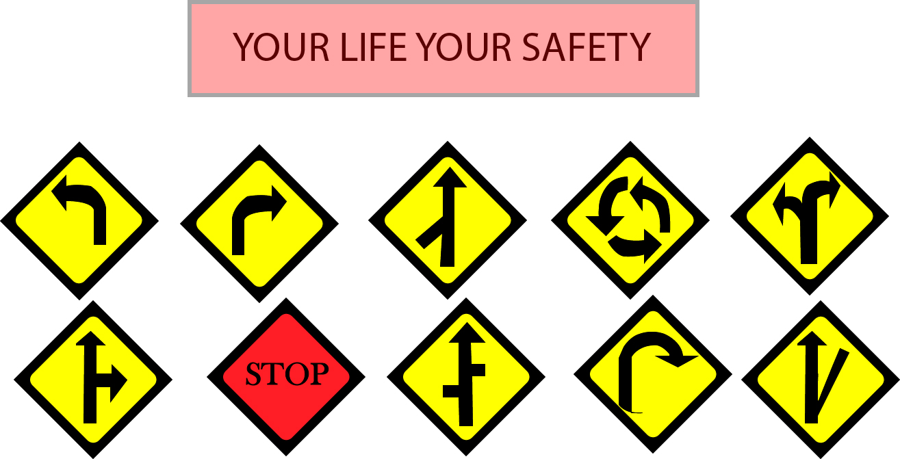

# Traffic safety signs SVG's!
This website is created for the purpose of serving the people by providing traffic safety sign SVG's for free. Our vision is the accident free world. In today's modern world the number of automobiles has been increased, which also increased the accident probability, So our website provides the fully glowing safety signs at no extra cost. Just you need to print them or download them and take the benifit.

## Getting started
These instructions will get you the copy of project and will also guide you about how to develop and test it. See Deployment for notes on how to deploy the project on your Mac/Pc.

Steps :-
1. Clone or download zip file of the project in your live system.
2. Extract the files in the folder of your choice.
3. In the folder named Singh_Jaskaran_SVG's, open the link of index.html for accessing the SVG's page of website.
4. click on the "Get this SVG" and after the tick mark is shown, the selected SVG will start downloading.

## Prerequistes
To run the index.html file , you will require to install browser such as google chrome or firefox. And for editing the templates you need the licensed software of Adobe Photoshop and Adobe illutrator.

## Author
JASKARAN SINGH

## License
The project is copyright of Singh@2020 
